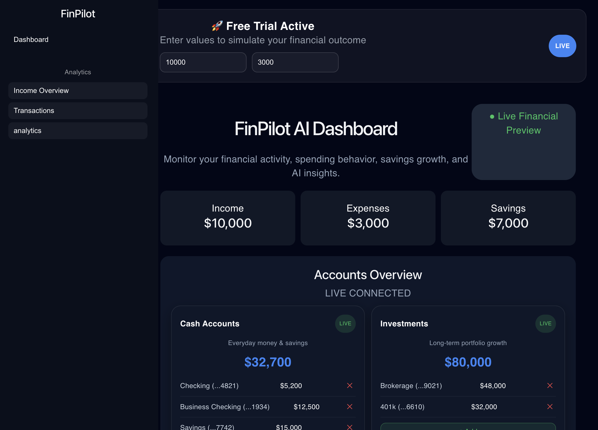
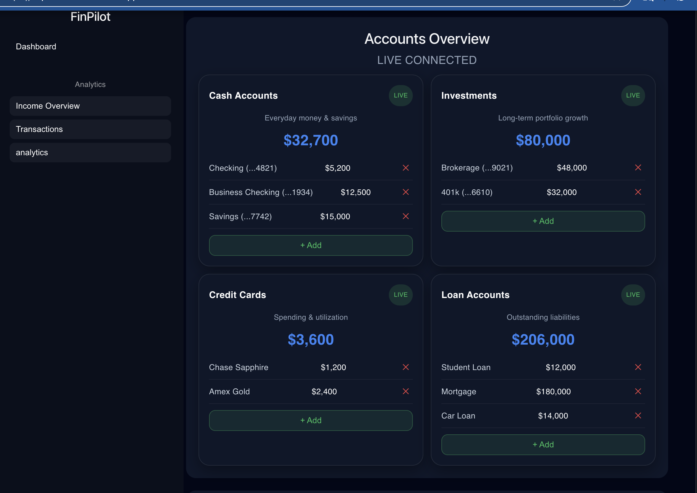
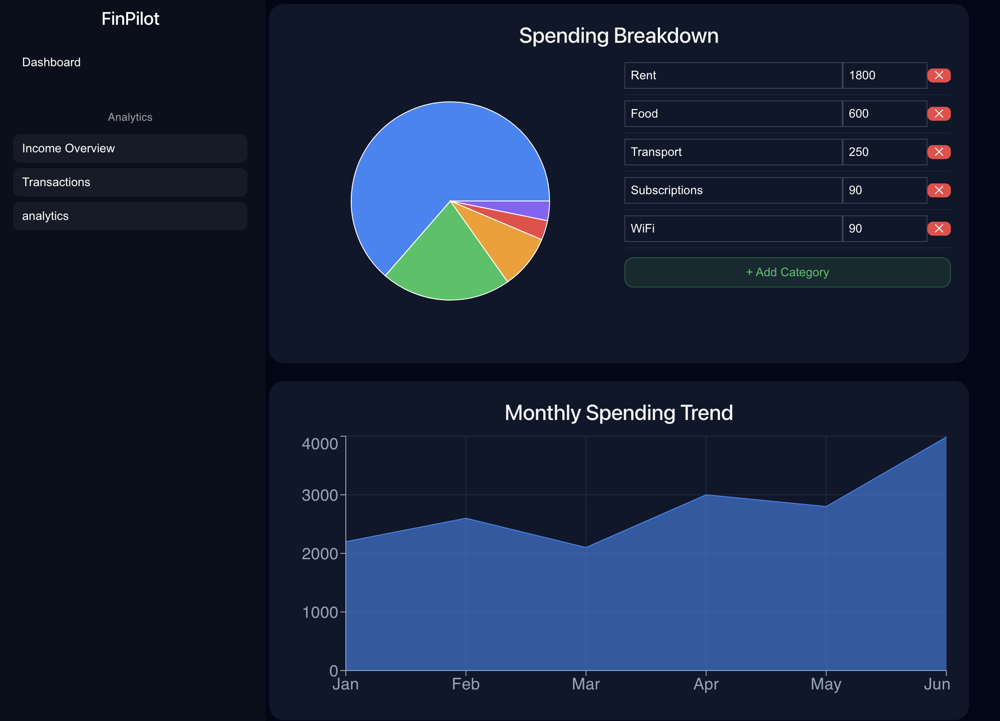
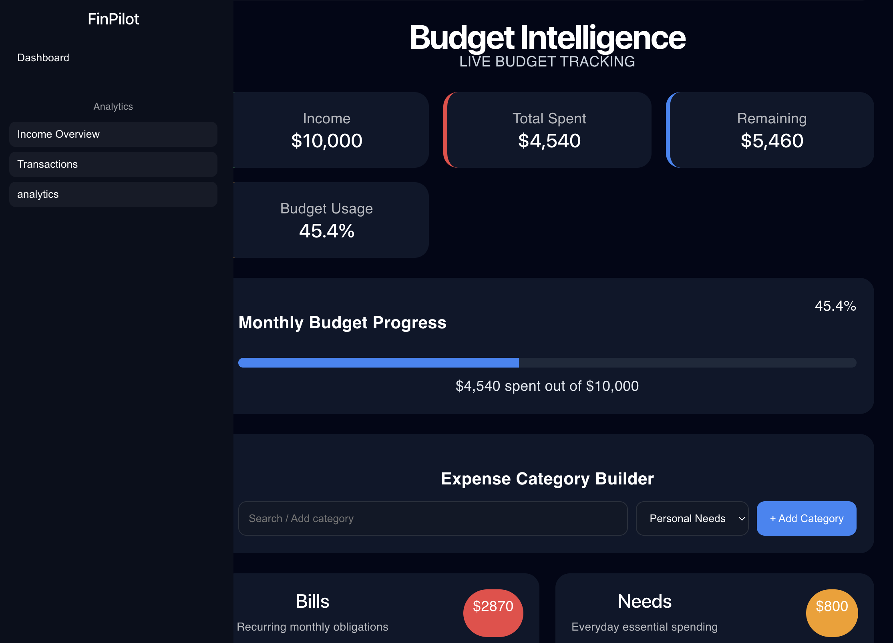

# 👨‍💻 Maryhelen Gonzalez — Personal Portfolio

Cybersecurity Engineer • Software Engineer • Systems Architecture & Security  
📍 New York, USA

---

## 🌐 Live Portfolio
👉 https://your-vercel-link.vercel.app

---

## ⚡ About This Project

This is my personal developer portfolio built to showcase my journey in **Computer Science, Cybersecurity, and Software Engineering**.

It highlights my:
- Technical skills
- Career progression
- Key projects
- Contact information

The design focuses on a **modern, glassmorphism-inspired UI** with a strong emphasis on clarity, structure, and professional presentation.

---

## 🧠 Tech Stack

- React
- JavaScript (ES6+)
- HTML5 / CSS3
- Vite
- Git & GitHub

---

## 📸 Project Preview

### Dashboard UI

### Analytics View

### Accounts Overview

### Full App Preview

---

- 📊 Real-time financial analytics
- 💳 Multi-account tracking (checking, savings, investments)
- 📈 Interactive charts & performance breakdown
- 🤖 AI-driven financial insights
- ⚡ Fast, responsive UI (React + Vite)
- 🔐 Secure data structure design

---
